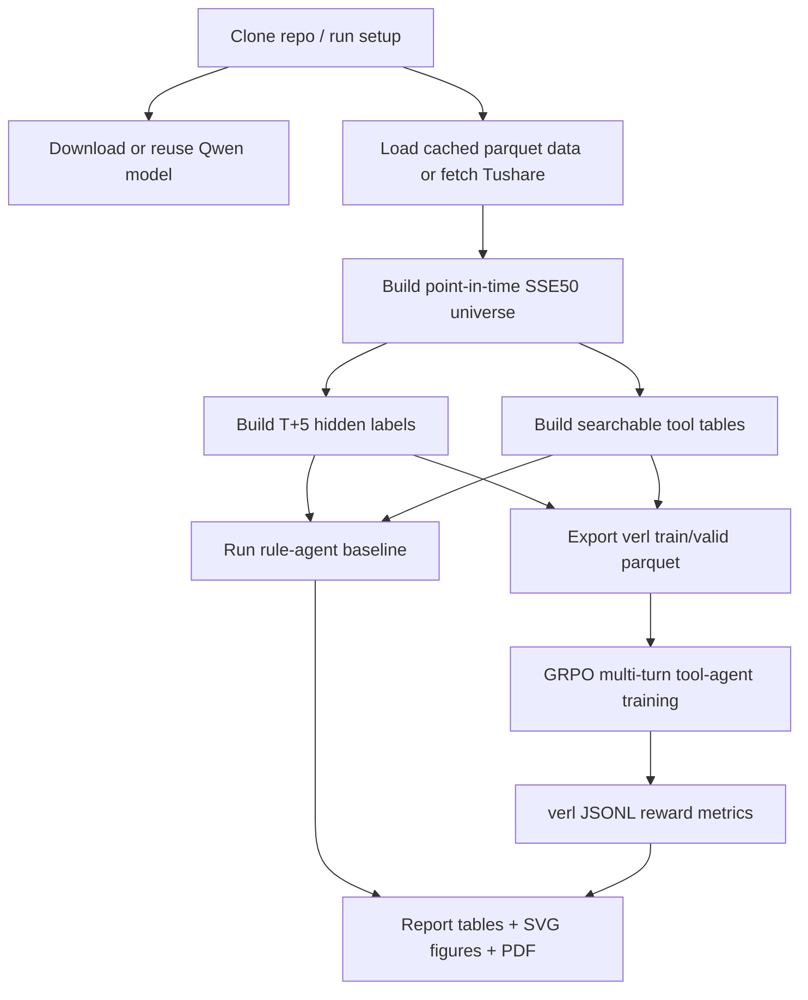

# Fin_search_agentRL

MVP for a stock search-agent RLVR experiment with Tushare data and verl.

## Directory Layout

- `stock_agent_rl_mvp.py`: CLI/main entrypoint.
- `rl_common.py`: shared constants, local config, table cache helpers, and path helpers.
- `rl_config.py`: runtime config dataclass.
- `rl_data.py`: Tushare download, factor snapshots, task and label construction.
- `rl_tools.py`: verl function-call tools for price factors, market context, and announcements.
- `rl_reward.py`: standalone verl reward function file containing `compute_score`.
- `rl_dataset.py`: prompt building and verl parquet export.
- `rl_baseline.py`: local rule-agent baseline and metrics.
- `rl_verl.py`: model download helpers and generated verl command.
- `rl_report.py`: report builder for CSV/Markdown tables, SVG figures, and one summary PDF.
- `data/`: local/reusable market data cache. Parquet caches can be synced to avoid slow repeated Tushare calls.
- `model/`: local model weights, for example `model/Qwen3-4B`. Ignored by git.
- `result/`: per-run outputs. Each run creates `HHMMSS_MMDD_result/`. Ignored by git except `.gitkeep`.
- `verl-main/`: local verl framework copy used by the generated training script.

## Experiment Flow



## Quick Start

先手动把仓库 clone 到你指定的目录：

```bash
mkdir -p /kunlun_data/temp_ag_rl
cd /kunlun_data/temp_ag_rl
git clone https://gitee.com/fduseven/fin_search_agent-rl.git Fin_search_agentRL
cd /kunlun_data/temp_ag_rl/Fin_search_agentRL
```

云平台任务的启动命令不需要写 clone，只需要进入已存在的项目目录并执行统一入口：

```bash
bash -lc '
set -e
cd /kunlun_data/temp_ag_rl/Fin_search_agentRL
git pull origin master
bash run_stock_agent_rl.sh "your_token"
'
```

它会按 `requirements-stockverl.txt` 锁定版本安装依赖、下载 `Qwen/Qwen3-4B`、检测 8 张 70GB+ GPU，然后启动全参数 GRPO 训练。脚本默认 `--env-mode auto`：如果镜像里有 conda 就复用/创建 `stockverl` 环境；如果没有 conda，就直接使用镜像自带的 `python3.10`/`python3` 安装依赖并运行。默认 profile 是 8 卡 A800：`train_batch_size=64`、`rollout_n=4`、`rollout_tp=4`、`max_prompt_length=3072`、`max_response_length=1024`，LoRA 默认关闭。

统一入口会把所有 stdout/stderr 同步写到项目根目录的 `output.log`，每次运行都会覆盖旧日志。云服务器上任务结束后可以直接查看：

```bash
cd /kunlun_data/temp_ag_rl/Fin_search_agentRL
tail -n 200 output.log
```

如果已经装好环境和模型，只想直接跑训练：

```bash
bash run_stock_agent_rl.sh "your_token" --no-setup
```

如果你明确不想使用 conda，可以加：

```bash
bash run_stock_agent_rl.sh "your_token" --env-mode system
```

如果不想每次在命令里传 token，可以用本地配置文件：

```bash
cp local_config.example.py local_config.py
```

Open `local_config.py` and paste your Tushare token. Then run:

```bash
bash run_stock_agent_rl.sh
```

If you only want to set up the environment without training:

```bash
bash setup_stockverl_env.sh --cn-mirror --download-model
```

## Single RTX 3090 Smoke Test

如果你只想在自己的单卡 3090 服务器上跑通 full flow，可以用小模型入口：

```bash
bash run_3090_small.sh "your_token"
```

这个脚本默认下载 `Qwen/Qwen3-0.6B` 到 `model/Qwen3-0.6B`，然后调用同一套 full-flow 代码，只是使用单卡 debug 配置、小 batch、较少股票和任务数，并默认加 `--no-fetch-fundamentals` 跳过基本面抓取，避免 Tushare 财务公告日期脏数据打断 smoke test。3090 入口把 prompt budget 设为 `4096`、response budget 设为 `256`，避免工具调用模板把样本全部过滤掉。它仍然会跑数据构造、工具调用、rule baseline、verl GRPO 训练和 reward 评估链路；目标是先跑通和看到 reward 动起来，不是正式效果实验。

完整输出会写到 `output_3090_small.log`，训练入口自己的输出也会继续写到 `output.log`。

如果 3090 显存余量还可以，想试稍大一点的小模型：

```bash
MODEL_ID=Qwen/Qwen3-1.7B MODEL_DIR=model/Qwen3-1.7B bash run_3090_small.sh "your_token"
```

如果环境和模型已经装好：

```bash
bash run_3090_small.sh "your_token" --no-setup --no-download-model
```

如果 3090 small 日志里出现 `Qwen3ForCausalLM contains 4.02B parameters`，但模型路径是 `model/Qwen3-0.6B`，说明服务器上的小模型目录装错了，里面实际是 4B 权重。先挪走错目录，然后重新下载：

```bash
mv model/Qwen3-0.6B model/Qwen3-0.6B_wrong_4b
bash run_3090_small.sh "your_token"
```

`--cn-mirror` prefers China-side mirrors first and falls back automatically:

- pip packages: Tsinghua PyPI -> Aliyun PyPI -> official PyPI
- PyTorch wheels: Tsinghua PyTorch wheels -> Aliyun PyTorch wheels -> official PyTorch wheels
- model weights: ModelScope -> HuggingFace mirror -> official HuggingFace

Downloaded wheels and hub caches are kept under `.cache/` by default, so repeated runs on the same persistent disk can reuse them.

The setup script defaults to `--dependency-policy compatible`: it first diagnoses packages already present in the image and only installs missing or import-broken packages. To force the exact locked versions in `requirements-stockverl.txt`, use:

```bash
bash setup_stockverl_env.sh --env-mode system --dependency-policy strict
```

To inspect a new cloud image without installing anything:

```bash
bash setup_stockverl_env.sh --env-mode system --diagnose-only
```

CUDA 13.0 driver 下脚本默认安装 PyTorch `cu128` wheel，这是正常的；NVIDIA driver 向下兼容 CUDA 12.8 runtime。

8 卡 A800 正式 full-flow 训练入口就是：

```bash
cd /kunlun_data/temp_ag_rl/Fin_search_agentRL
git pull origin master
bash run_stock_agent_rl.sh "your_token"
```

这个入口默认使用 `Qwen/Qwen3-4B`、8 卡 A800 profile、全参数 GRPO，并保留基本面工具。基本面数据里的空 `ann_date` 会被自动过滤，不需要额外加 `--no-fetch-fundamentals`。

如果云服务器只给了 4 卡 A800，先用 4 卡入口跑通：

```bash
cd /kunlun_data/temp_ag_rl/Fin_search_agentRL
git pull origin master
bash run_stock_a800_4gpu.sh "your_token"
```

这个入口默认安装 `flash-attn`，因为当前 verl 训练阶段会 import `flash_attn.bert_padding`；然后用 `Qwen/Qwen3-4B`、4 卡、`rollout_tp=2`、较小 batch 跑 full flow。完整日志写到 `output_a800_4gpu.log`。

因为每次云任务都会重新分配容器，但 `/kunlun_data/` 会持久挂载，4 卡入口默认把可复用内容放在项目父目录 `/kunlun_data/temp_ag_rl/`：

```text
/kunlun_data/temp_ag_rl/venvs/stockverl       # persistent Python venv
/kunlun_data/temp_ag_rl/.cache/               # pip/HF/ModelScope caches
/kunlun_data/temp_ag_rl/model/Qwen3-4B        # model weights
```

第一次运行仍然会安装依赖和下载模型；后续新任务挂载同一个 `/kunlun_data/` 后会复用这些目录，启动会快很多。这个入口固定使用持久化 venv，不走 conda。

如果镜像缺少 `python3.10-venv`/`ensurepip`，4 卡入口会在 root + apt 可用时自动安装 `python3-venv` 和 `python3-pip`，再创建持久 venv。

如果当前只拿到 2 卡 A800，可以用更小的 2 卡入口先跑通：

```bash
cd /kunlun_data/temp_ag_rl/Fin_search_agentRL
git pull origin master
bash run_stock_a800_2gpu.sh "your_token"
```

这个入口复用同一套持久化 venv/cache/model 目录，但默认改成 `n_gpus_per_node=2`、`rollout_tp=1`、更小 batch、`rollout_n=2`、`max_tasks=4000`。完整日志写到 `output_a800_2gpu.log`。

如果使用已经预装 verl/vLLM/flash-attn 的镜像，例如 `openclaw-rl`，先验证环境：

```bash
python - <<'PY'
import torch, ray, vllm, flash_attn
print("torch:", torch.__version__, torch.version.cuda, torch.cuda.is_available(), torch.cuda.device_count())
print("ray:", ray.__version__)
print("vllm:", vllm.__version__)
print("flash_attn:", flash_attn.__version__)
PY
```

如果验证通过，并且 `/kunlun_data/temp_ag_rl/model/Qwen3-4B` 已存在，可以直接复用镜像里的 Python 环境：

```bash
bash run_stock_a800_2gpu.sh "your_token" --python-bin "$(which python)" --no-setup --no-download-model
```

Advanced direct Python entry:

```bash
python3 stock_agent_rl_mvp.py --mode all-train --tushare-token "your_token"
```

Current full-flow version builds:

- point-in-time tasks and hidden labels for T+5 relative-return classification
- price, market, industry, peer, fundamental, announcement, and news/event tool tables
- veRL multi-turn GRPO parquet data and command script
- optional rule-trajectory SFT parquet data and SFT command script
- rule baseline metrics: reward, accuracy, Macro-F1, Brier, Rank IC, and top-bottom return
- report artifacts for mentor review: CSV/Markdown tables, SVG charts, and `stock_agent_rl_report.pdf`

Each run writes reports under:

```bash
result/<HHMMSS_MMDD_result>/report/
```

Important report files:

- `stock_agent_rl_report.pdf`: summary bundle for mentor review.
- `report_index.md`: clickable report index with artifact list and short interpretation.
- `tables/reward_progress.csv`: first/last/best RL reward and reward delta parsed from verl JSONL metrics.
- `tables/baseline_vs_rl_reward.csv`: rule baseline reward plus RL first/last/best reward.
- `tables/baseline_metrics.csv`: rule baseline reward, accuracy, Macro-F1, Brier, Rank IC, and top-bottom return.
- `figures/rl_reward_curve.svg`: RL reward curve.
- `figures/baseline_vs_rl_reward.svg`: baseline vs RL reward bars.
- `figures/baseline_mean_reward_by_split.svg`: rule baseline reward by split.
- `figures/label_distribution.svg` and `figures/prediction_distribution.svg`: data and prediction sanity checks.
- `figures/rule_reward_histogram.svg`: sample-level rule reward distribution.
- `figures/alpha_score_vs_future_relative_return.svg`: rule alpha score versus realized relative return.

If training failed or was interrupted, generate a report from the newest run with:

```bash
python3 stock_agent_rl_mvp.py --mode report-latest
```

For a specific run directory:

```bash
python3 stock_agent_rl_mvp.py --mode report-run --run-dir result/HHMMSS_MMDD_result
```

If you only want to build data and generate the training script:

```bash
python3 stock_agent_rl_mvp.py --mode all --tushare-token "your_token"
```

To generate only the cold-start SFT files and command:

```bash
python3 stock_agent_rl_mvp.py --mode print-sft-command --tushare-token "your_token"
```

If training was interrupted and you want to run the latest generated training script:

```bash
python3 stock_agent_rl_mvp.py --mode train-latest
```

To download Qwen3-4B manually instead of auto-downloading:

```bash
pip install -U modelscope
modelscope download --model Qwen/Qwen3-4B --local_dir model/Qwen3-4B
```

Then disable auto-download:

```bash
python3 stock_agent_rl_mvp.py --mode all-train --no-auto-download-model --tushare-token "your_token"
```

For the custom Tushare endpoint, the script sets:

```python
pro._DataApi__http_url = "http://lianghua.nanyangqiankun.top"
```

Do not commit `model/` or `result/` contents.

For this project, only reusable parquet data caches should be synced. The code reads `.parquet` first, then falls back to `.pkl` and `.csv`, so syncing parquet is enough and avoids slow repeated Tushare calls:

```bash
git add data/raw/*.parquet data/processed/*.parquet
git commit -m "Add cached parquet data"
git push origin master
```

Do not sync `data/**/*.csv`, `data/**/*.pkl`, `model/`, `result/`, `.cache/`, or `output.log`.
